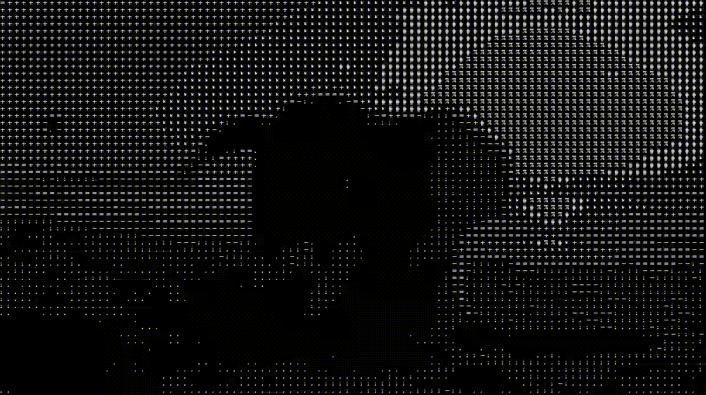

# video2ascii_converter
A little challange with C++ and OpenCV (v16 is used) for fun. 

### How It Looks

|                                             |                                          |
:-------------------------------------------:|:----------------------------------------:
|              ORIGINAL VERSION               |              ASCII VERSION               |
|  |  |

###### NOTE : The reason why the ascii version is slower is that it uses too many ascii characters in pixels. if you increase the size of the ascii characters, i.e. use fewer characters, you will speed up. Additionally, if you make the project multithreaded you can speed it up to the same speed as the original version. 